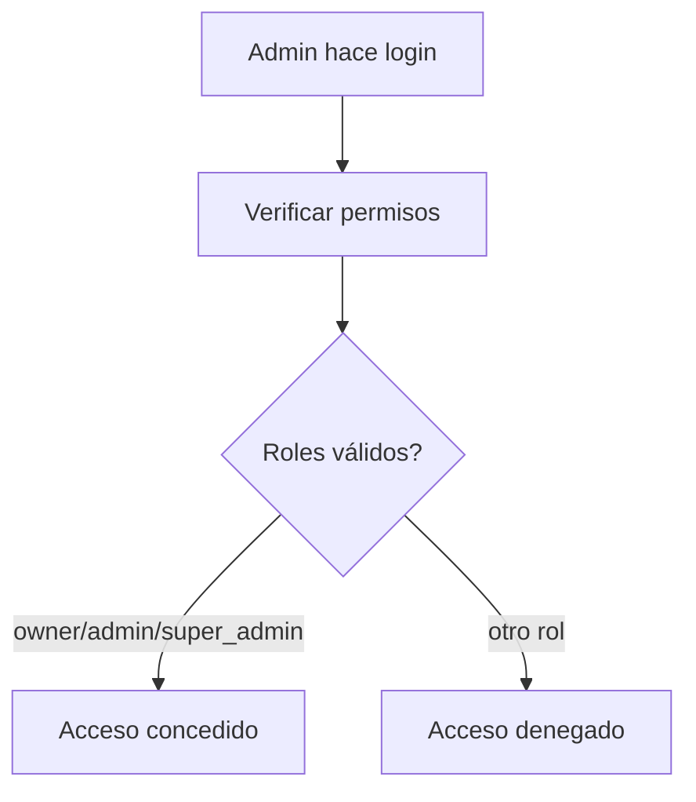
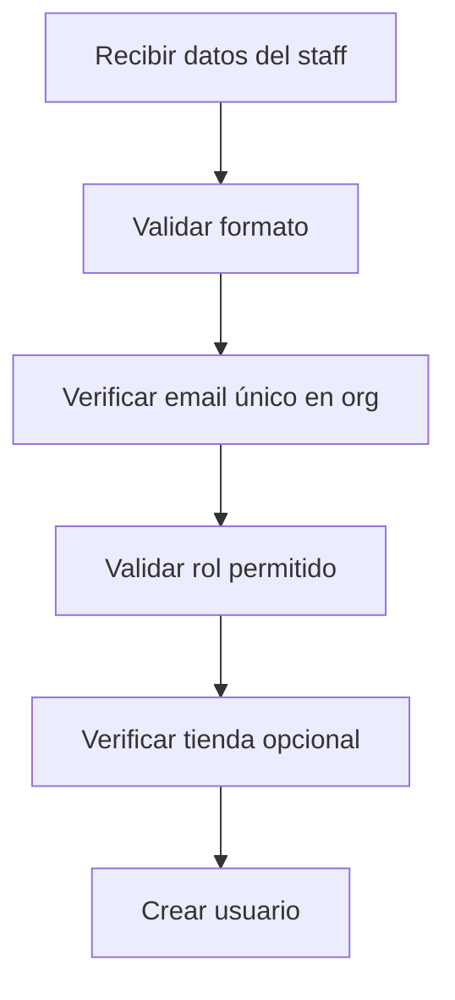
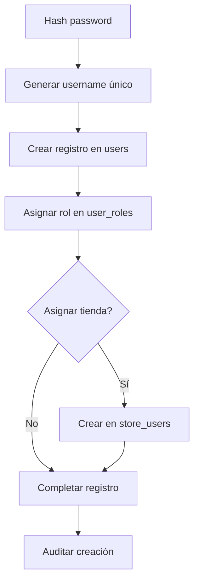

# 👥 Proceso de Registro de Staff - Vendix Backend

**Fecha:** Septiembre 2025
**Versión:** 1.0
**Estado:** ✅ Implementado y Probado

---

## 🎯 **Objetivo**

Permitir que usuarios con permisos administrativos (owner, admin, super_admin) puedan crear cuentas de staff con roles específicos dentro de su organización, manteniendo la separación de datos multi-tenant.

---

## 🔄 **Flujo Completo del Proceso**

### **1. Autenticación del Administrador**


### **2. Validación de Datos**


### **3. Creación del Usuario**


---

## 📋 **Roles Disponibles para Staff**

### **Jerarquía de Roles**
```
super_admin (solo para sistema)
├── owner (propietario de organización)
├── admin (administrador de organización)
├── manager (gerente de tienda)
├── supervisor (supervisor de tienda)
└── employee (empleado de tienda)
```

### **Permisos para Crear Staff**
- ✅ **super_admin**: Puede crear cualquier rol
- ✅ **owner**: Puede crear manager, supervisor, employee
- ✅ **admin**: Puede crear manager, supervisor, employee
- ❌ **manager/supervisor/employee**: No pueden crear staff

---

## 🔗 **Endpoints y Funcionalidades**

### **POST /api/auth/register-staff**

#### **Parámetros Requeridos:**
```typescript
{
  first_name: string,    // 1-100 caracteres
  last_name: string,     // 1-100 caracteres
  email: string,         // Email válido, único en organización
  password: string,      // Mínimo 8 caracteres
  role: string           // 'manager' | 'supervisor' | 'employee'
}
```

#### **Parámetros Opcionales:**
```typescript
{
  store_id?: number      // ID de tienda para asignar staff
}
```

#### **Respuesta Exitosa:**
```json
{
  "message": "Usuario manager creado exitosamente",
  "data": {
    "id": 6,
    "username": "carlos.rodriguez",
    "email": "carlos.rodriguez@vendix.com",
    "first_name": "Carlos",
    "last_name": "Rodriguez",
    "organization_id": 1,
    "user_roles": [
      {
        "id": 6,
        "role_id": 4,
        "roles": {
          "id": 4,
          "name": "manager",
          "description": "Gerente de tienda"
        }
      }
    ]
  }
}
```

---

## 🔐 **Validaciones de Seguridad**

### **1. Autenticación y Autorización**
```typescript
// Verificar token JWT válido
@UseGuards(JwtAuthGuard)

// Verificar permisos del administrador
const hasPermission = adminUser.user_roles.some(ur =>
  ur.roles?.name === 'owner' ||
  ur.roles?.name === 'admin' ||
  ur.roles?.name === 'super_admin'
);
```

### **2. Validación de Datos**
```typescript
// DTO con validaciones de class-validator
export class RegisterStaffDto {
  @IsString()
  @MinLength(1)
  @MaxLength(100)
  first_name: string;

  @IsEmail()
  @MaxLength(255)
  email: string;

  @IsString()
  @MinLength(8)
  @MaxLength(255)
  password: string;

  @IsEnum(['manager', 'supervisor', 'employee'])
  role: string;
}
```

### **3. Unicidad de Email por Organización**
```typescript
// Verificar que el email no existe en la organización
const existingUser = await this.prismaService.users.findFirst({
  where: {
    email,
    organization_id: adminUser.organization_id,
  },
});
```

### **4. Validación de Tienda (Opcional)**
```typescript
if (store_id) {
  const store = await this.prismaService.stores.findFirst({
    where: {
      id: store_id,
      organization_id: adminUser.organization_id,
    },
  });
}
```

---

## 🗄️ **Operaciones de Base de Datos**

### **1. Creación del Usuario**
```sql
INSERT INTO users (
  email,
  password,
  first_name,
  last_name,
  username,
  organization_id,
  email_verified,
  state
) VALUES (
  'carlos.rodriguez@vendix.com',
  '$2b$12$hashed_password_here',
  'Carlos',
  'Rodriguez',
  'carlos.rodriguez',
  1,
  true,
  'active'
);
```

### **2. Asignación de Rol**
```sql
INSERT INTO user_roles (user_id, role_id)
VALUES (6, 4); -- 4 = manager role
```

### **3. Asignación a Tienda (Opcional)**
```sql
INSERT INTO store_users (store_id, user_id)
VALUES (1, 6);
```

---

## 📊 **Información Generada Automáticamente**

### **Username Único**
```typescript
private async generateUniqueUsername(email: string): Promise<string> {
  const baseUsername = email.split('@')[0];
  let username = baseUsername;
  let counter = 1;

  while (await this.prismaService.users.findUnique({ where: { username } })) {
    username = `${baseUsername}${counter}`;
    counter++;
  }

  return username;
}
```

### **Password Hasheado**
```typescript
const hashedPassword = await bcrypt.hash(password, 12);
```

### **Email Verificado**
```typescript
// Staff creado por admin = email automáticamente verificado
email_verified: true
```

### **Estado Activo**
```typescript
// Usuario listo para usar inmediatamente
state: 'active'
```

---

## 🧪 **Casos de Uso**

### **1. Crear Gerente de Tienda**
```bash
POST /api/auth/register-staff
{
  "first_name": "Carlos",
  "last_name": "Rodriguez",
  "email": "carlos.rodriguez@vendix.com",
  "password": "password123",
  "role": "manager",
  "store_id": 1
}
```

### **2. Crear Empleado General**
```bash
POST /api/auth/register-staff
{
  "first_name": "Ana",
  "last_name": "Martinez",
  "email": "ana.martinez@vendix.com",
  "password": "password123",
  "role": "employee"
}
```

### **3. Crear Supervisor**
```bash
POST /api/auth/register-staff
{
  "first_name": "Luis",
  "last_name": "Garcia",
  "email": "luis.garcia@vendix.com",
  "password": "password123",
  "role": "supervisor"
}
```

---

## ⚠️ **Manejo de Errores**

### **Errores Comunes:**

#### **1. Sin Permisos**
```json
{
  "message": "No tienes permisos para crear usuarios staff",
  "error": "Unauthorized",
  "statusCode": 401
}
```

#### **2. Email Duplicado**
```json
{
  "message": "El usuario con este email ya existe en esta organización",
  "error": "Bad Request",
  "statusCode": 400
}
```

#### **3. Rol Inválido**
```json
{
  "message": "Rol inválido. Roles válidos: manager, supervisor, employee",
  "error": "Bad Request",
  "statusCode": 400
}
```

#### **4. Tienda No Encontrada**
```json
{
  "message": "Tienda no encontrada o no pertenece a tu organización",
  "error": "Bad Request",
  "statusCode": 400
}
```

---

## 📈 **Auditoría y Logs**

### **Registro de Auditoría**
Cada creación de staff se registra automáticamente:
```typescript
await this.auditService.logCreate(
  adminUserId,
  AuditResource.USERS,
  newUser.id,
  {
    email,
    first_name,
    last_name,
    role,
    store_id,
    created_by: adminUserId,
  },
  {
    description: `Usuario staff creado por administrador ${adminUser.email}`
  }
);
```

### **Información Auditada:**
- ID del administrador que creó el usuario
- Datos del nuevo usuario creado
- Timestamp de creación
- IP y User Agent del administrador
- Descripción de la acción

---

## 🔧 **Configuración y Personalización**

### **Roles Permitidos**
```typescript
// Configurable en el servicio
const validRoles = ['manager', 'supervisor', 'employee'];
```

### **Longitud de Password**
```typescript
// Configurable via validadores
@MinLength(8)
@MaxLength(255)
password: string;
```

### **Verificación de Email**
```typescript
// Actualmente automático para staff
email_verified: true
// Podría hacerse configurable en el futuro
```

---

## 🚀 **Características Avanzadas**

### **1. Asignación Automática de Username**
- Basado en el email
- Garantiza unicidad
- Formato: `nombre.apellido` o `nombre.apellido1`, `nombre.apellido2`, etc.

### **2. Separación Multi-Tenant**
- Email único por organización
- Usuario pertenece exclusivamente a la organización del admin
- No hay cross-contamination entre organizaciones

### **3. Seguridad por Defecto**
- Password hasheado con bcrypt
- Email verificado automáticamente
- Usuario activo inmediatamente
- Auditoría completa

### **4. Flexibilidad de Asignación**
- Rol obligatorio
- Tienda opcional
- Expansible para campos adicionales

---

## 📋 **Checklist de Validación**

### **✅ Funcionalidad Core**
- [x] Endpoint POST `/auth/register-staff`
- [x] Validación de permisos de administrador
- [x] Creación de usuario con datos correctos
- [x] Asignación de rol apropiado
- [x] Asignación opcional a tienda
- [x] Auditoría de creación

### **✅ Validaciones**
- [x] Email único por organización
- [x] Roles válidos (manager, supervisor, employee)
- [x] Tienda pertenece a la organización
- [x] Formato de datos correcto
- [x] Password seguro

### **✅ Seguridad**
- [x] Autenticación JWT requerida
- [x] Autorización por roles
- [x] Hash de password
- [x] Email verificado
- [x] Auditoría completa

### **✅ Testing**
- [x] Casos de éxito probados
- [x] Casos de error validados
- [x] Tests HTTP disponibles
- [x] Documentación completa

---

## 🎯 **Conclusión**

El proceso de registro de staff está completamente implementado y proporciona:

- ✅ **Seguridad robusta** con validaciones multi-nivel
- ✅ **Flexibilidad** para diferentes roles y asignaciones
- ✅ **Separación de datos** perfecta entre organizaciones
- ✅ **Auditoría completa** de todas las acciones
- ✅ **Experiencia de usuario** fluida para administradores

El sistema está listo para producción y puede manejar la creación de staff de manera segura y eficiente dentro del ecosistema multi-tenant de Vendix.</content>
<parameter name="filePath">/home/rzydev/Vendix/apps/backend/doc/Auth/Register Staff/RegisterStaffProcess.md
