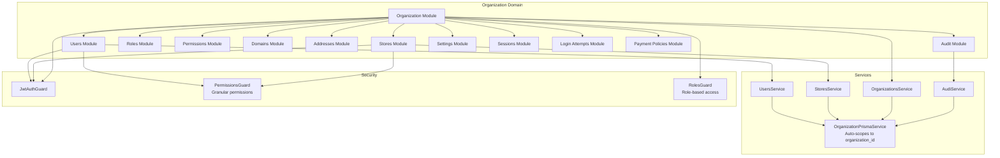

# Organization Domain

## What is the Organization Domain?

The **Organization Domain** manages multi-tenant operations at the organization level, providing functionality for organization owners and administrators to manage their organization's resources, users, stores, and settings within the boundaries of their organization.

## Route Prefixes

Organization routes are not prefixed (unlike superadmin routes) and rely on automatic scoping:

```
POST   /users              # Create user in current organization
GET    /users              # List users in current organization
PATCH  /users/:id          # Update user in current organization
DELETE /users/:id          # Delete user from current organization

POST   /stores             # Create store in current organization
GET    /stores             # List stores in current organization
GET    /stores/stats       # Organization-wide store statistics

GET    /settings           # Get organization settings
PATCH  /settings           # Update organization settings
```

## Authentication and Context

The login or access token already comes with the context of the respective domain. All operations require authenticated user context with `organization_id`, and the system automatically applies `organization_id` filtering to ensure users can only access data within their organization.

### **Business Responsibilities**

- **Organization Management**: Handle organization-level settings, profiles, and configurations
- **User Administration**: Manage users within the organization (excluding super admin operations)
- **Store Lifecycle**: Create and manage stores belonging to the organization
- **Role & Permission Management**: Define organization-specific roles and assign permissions
- **Security & Audit**: Monitor login attempts, sessions, and maintain audit trails
- **Domain Configuration**: Manage custom domains and SSL certificates for the organization

### **User Roles with Access**

- **Owner**: Full access to all organization operations
- **Admin**: Administrative access with some restrictions
- **Manager**: Limited management capabilities
- **Employee/Staff**: Basic operational access

## 🔐 Automatic Scoping System

### **PrismaService Used**

The Organization Domain uses **`OrganizationPrismaService`** which automatically applies `organization_id` filtering to all scoped database operations.

```typescript
// Organization domain module configuration
@Module({
  providers: [OrganizationPrismaService], // Automatic organization_id filtering
  exports: [OrganizationPrismaService],
})
export class OrganizationDomainModule {}
```

### **How Automatic Filtering Works**

- **Mandatory Context**: All operations require authenticated user context with `organization_id`
- **Automatic Filtering**: Scoped models automatically receive `WHERE organization_id = ?` clauses
- **Security Enforcement**: Throws `ForbiddenException` if `organization_id` is missing

### **Security Implications**

- **Tenant Isolation**: Users can only access data within their organization
- **Context Validation**: Every request must include valid organization context
- **Fail-Fast Security**: Immediate rejection of requests without proper organization context

### **Examples of Scoped vs Non-Scoped Operations**

```typescript
// Organization Service (Automatic Scoping)
@Injectable()
export class OrgUsersService {
  constructor(private readonly prisma: OrganizationPrismaService) {}

  // Automatically filtered to current user's organization
  async getMyUsers() {
    return this.prisma.users.findMany(); // WHERE organization_id = context.organization_id
  }

  // Manual override for cross-organization access (rare)
  async getUsersFromOrg(orgId: number) {
    return this.prisma.withoutScope().users.findMany({
      where: { organization_id: orgId },
    });
  }
}

// Store Service (Different Scope)
@Injectable()
export class StoreService {
  constructor(private readonly prisma: StorePrismaService) {}

  // Automatically filtered to current user's store
  async getMyProducts() {
    return this.prisma.products.findMany(); // WHERE store_id = context.store_id
  }
}
```

## 📁 Module Structure

The Organization Domain consists of the following modules:

| Module                  | Purpose                             | Key Operations                                |
| ----------------------- | ----------------------------------- | --------------------------------------------- |
| **`organizations/`**    | Organization profile and settings   | Update organization details, manage addresses |
| **`users/`**            | User management within organization | CRUD users, assign roles, manage permissions  |
| **`stores/`**           | Store management for organization   | Create stores, manage store settings          |
| **`roles/`**            | Role and permission administration  | Define roles, assign permissions to users     |
| **`permissions/`**      | Permission management               | Grant/revoke specific permissions             |
| **`domains/`**          | Custom domain configuration         | Domain registration, SSL management           |
| **`addresses/`**        | Address management                  | Organization and store addresses              |
| **`audit/`**            | Audit logging and monitoring        | Track user activities and changes             |
| **`settings/`**         | Organization-wide settings          | Configuration management                      |
| **`sessions/`**         | Session management                  | User session tracking and management          |
| **`login-attempts/`**   | Security monitoring                 | Failed login tracking and analysis            |
| **`payment-policies/`** | Payment configuration               | Organization payment settings                 |

### **Module Interaction with Scoping**

- All modules inject `OrganizationPrismaService` for automatic tenant isolation
- Cross-organization operations require explicit `withoutScope()` calls (rare, audited)
- Audit modules track all operations for compliance and security

## 🌐 API Routes & Access

### **Route Patterns**

Organization routes are not prefixed (unlike superadmin routes) and rely on automatic scoping:

```
POST   /users              # Create user in current organization
GET    /users              # List users in current organization
PATCH  /users/:id          # Update user in current organization
DELETE /users/:id          # Delete user from current organization

POST   /stores             # Create store in current organization
GET    /stores             # List stores in current organization
GET    /stores/stats       # Organization-wide store statistics

GET    /settings           # Get organization settings
PATCH  /settings           # Update organization settings
```

### **Authentication Requirements**

- **JWT Authentication**: Required for all endpoints
- **Permission-based Access**: Uses `@Permissions('resource:action')` decorators
- **Guards Applied**: `JwtAuthGuard` + `PermissionsGuard`

```typescript
@Controller('users')
@UseGuards(PermissionsGuard)
export class UsersController {
  // All methods require specific permissions
  @Post()
  @Permissions('users:create')
  async create(@Body() createUserDto: CreateUserDto) {
    // Only users with 'users:create' permission in same organization
  }
}
```

### **Permission Levels**

- **Granular Permissions**: 75+ specific permissions (e.g., `users:create`, `stores:read`)
- **Role-based Assignment**: Permissions assigned through roles
- **Context-aware**: Permissions only apply within user's organization

## 🛠️ Development Guidelines

### **When to Add New Modules to This Domain**

Add modules to the Organization Domain when they handle:

- **Organization-scoped operations** (affecting one organization)
- **Multi-store management** within an organization
- **User and role administration** at organization level
- **Organization-wide settings** and configurations

### **How to Ensure Proper Scoping**

1. **Always inject `OrganizationPrismaService`** in new services
2. **Use permission guards** on all controllers and methods
3. **Validate organization context** in business logic when needed
4. **Log security events** for audit trails

```typescript
// Correct: New organization service
@Injectable()
export class NewOrgService {
  constructor(private readonly prisma: OrganizationPrismaService) {}

  async organizationOperation() {
    // Automatically scoped to user's organization
    return this.prisma.someModel.findMany();
  }

  async crossOrgOperation(targetOrgId: number) {
    // Rare: explicit cross-organization access
    const data = await this.prisma.withoutScope().someModel.findMany({
      where: { organization_id: targetOrgId },
    });
    // Log this access for audit
    await this.auditService.logCrossOrgAccess(targetOrgId);
    return data;
  }
}
```

### **Testing Considerations**

- **Mock OrganizationPrismaService** with proper context
- **Test permission requirements** with different user roles
- **Verify scoping behavior** with multiple organizations
- **Test audit logging** is working correctly

```typescript
// Example test for organization service
describe('OrganizationUsersService', () => {
  let service: UsersService;
  let mockPrisma: jest.Mocked<OrganizationPrismaService>;

  beforeEach(() => {
    mockPrisma = createMock<OrganizationPrismaService>();
    service = new UsersService(mockPrisma);
  });

  it('should scope users to organization', async () => {
    const context = { organization_id: 123 };
    mockPrisma.users.findMany.mockResolvedValue([user1, user2]);

    const result = await service.getUsers();

    expect(mockPrisma.users.findMany).toHaveBeenCalledWith({
      where: { organization_id: 123 },
    });
    expect(result).toHaveLength(2);
  });
});
```

## 🏗️ Architecture Diagram



---

**🔒 Security Notice**: This domain implements automatic tenant isolation. All operations are scoped to the user's organization, preventing unauthorized cross-tenant access.</content>
<parameter name="filePath">apps/backend/src/domains/organization/README.md
