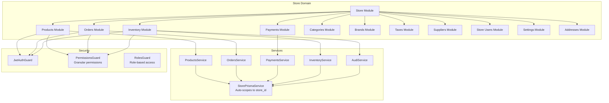

# Store Domain

## What is the Store Domain?

The **Store Domain** handles individual store operations within the Vendix multi-tenant e-commerce platform. This domain manages store-specific business logic, inventory, products, orders, and customer interactions at the most granular level of the tenant hierarchy.

## Route Prefixes

Store routes are not prefixed (unlike superadmin routes) and rely on automatic scoping:

```
POST   /products              # Create product in current store
GET    /products              # List products in current store
PATCH  /products/:id          # Update product in current store
DELETE /products/:id          # Delete product from current store

POST   /orders                # Create order in current store
GET    /orders                # List orders in current store
GET    /orders/:id            # Get specific order details

GET    /inventory             # Get inventory for current store
POST   /inventory/adjustments # Create inventory adjustment

GET    /payments              # List payments for current store
POST   /payments/:id/refund   # Process refund for store payment
```

## Authentication and Context

The login or access token already comes with the context of the respective domain. All operations require authenticated user context with `store_id`, and the system automatically applies `store_id` filtering to ensure users can only access data within their assigned store.

### **Business Responsibilities**

- **Product Management**: Catalog management, pricing, and product variants
- **Inventory Control**: Stock levels, locations, suppliers, and inventory transactions
- **Order Processing**: Sales orders, purchase orders, returns, and order fulfillment
- **Payment Processing**: Payment methods, transactions, and refunds
- **Customer Management**: Store-specific customer data and interactions
- **Store Configuration**: Store settings, branding, and operational parameters

### **User Roles with Access**

- **Store Owner**: Full access to store operations
- **Store Manager**: Administrative access within the store
- **Store Supervisor**: Limited management capabilities
- **Store Employee**: Basic operational access
- **Customer**: Limited access to customer-facing features

## 🔐 Automatic Scoping System

### **PrismaService Used**

The Store Domain uses **`StorePrismaService`** which automatically applies `store_id` filtering to all scoped database operations.

```typescript
// Store domain module configuration
@Module({
  providers: [StorePrismaService], // Automatic store_id filtering
  exports: [StorePrismaService],
})
export class StoreDomainModule {}
```

### **How Automatic Filtering Works**

- **Mandatory Context**: All operations require authenticated user context with `store_id`
- **Automatic Filtering**: Scoped models automatically receive `WHERE store_id = ?` clauses
- **Security Enforcement**: Throws `ForbiddenException` if `store_id` is missing

### **Security Implications**

- **Store Isolation**: Users can only access data within their assigned store
- **Granular Access**: Most restrictive scoping level in the platform
- **Context Validation**: Every request must include valid store context

### **Examples of Scoped vs Non-Scoped Operations**

```typescript
// Store Service (Automatic Scoping)
@Injectable()
export class ProductsService {
  constructor(private readonly prisma: StorePrismaService) {}

  // Automatically filtered to current user's store
  async getMyProducts() {
    return this.prisma.products.findMany(); // WHERE store_id = context.store_id
  }

  // Manual override for cross-store access (rare, audited)
  async getProductsFromStore(storeId: number) {
    return this.prisma.withoutScope().products.findMany({
      where: { store_id: storeId },
    });
  }
}

// Organization Service (Broader Scope)
@Injectable()
export class OrgStoresService {
  constructor(private readonly prisma: OrganizationPrismaService) {}

  // Automatically filtered to current user's organization
  async getMyStores() {
    return this.prisma.stores.findMany(); // WHERE organization_id = context.organization_id
  }
}
```

## 📁 Module Structure

The Store Domain consists of the following modules:

| Module             | Purpose                         | Key Operations                                   |
| ------------------ | ------------------------------- | ------------------------------------------------ |
| **`brands/`**      | Brand management within store   | Brand CRUD, brand-product associations           |
| **`categories/`**  | Product categorization          | Category hierarchy, product assignment           |
| **`products/`**    | Product catalog management      | Product CRUD, variants, pricing                  |
| **`orders/`**      | Order processing and management | Sales orders, fulfillment, status updates        |
| **`payments/`**    | Payment processing              | Transactions, refunds, payment methods           |
| **`inventory/`**   | Inventory management system     | Stock levels, locations, suppliers, transactions |
| **`taxes/`**       | Tax calculation and management  | Tax rates, tax rules application                 |
| **`addresses/`**   | Store address management        | Shipping addresses, billing addresses            |
| **`stores/`**      | Store profile and settings      | Store configuration, settings                    |
| **`suppliers/`**   | Supplier management             | Supplier CRUD, supplier-product links            |
| **`store-users/`** | Store user administration       | User roles within store context                  |
| **`settings/`**    | Store-specific configuration    | Store preferences, operational settings          |

### **Module Interaction with Scoping**

- All modules inject `StorePrismaService` for automatic store-level isolation
- Cross-store operations require explicit `withoutScope()` calls (rare, heavily audited)
- Inventory and order modules have complex interdependencies for stock management

## 🌐 API Routes & Access

### **Route Patterns**

Store routes are not prefixed (unlike superadmin routes) and rely on automatic scoping:

```
POST   /products              # Create product in current store
GET    /products              # List products in current store
PATCH  /products/:id          # Update product in current store
DELETE /products/:id          # Delete product from current store

POST   /orders                # Create order in current store
GET    /orders                # List orders in current store
GET    /orders/:id            # Get specific order details

GET    /inventory             # Get inventory for current store
POST   /inventory/adjustments # Create inventory adjustment

GET    /payments              # List payments for current store
POST   /payments/:id/refund   # Process refund for store payment
```

### **Authentication Requirements**

- **JWT Authentication**: Required for all endpoints
- **Permission-based Access**: Uses `@Permissions('resource:action')` decorators
- **Guards Applied**: `JwtAuthGuard` + `PermissionsGuard`

```typescript
@Controller('products')
@UseGuards(PermissionsGuard)
export class ProductsController {
  // All methods require specific permissions within store context
  @Post()
  @Permissions('products:create')
  async create(@Body() createProductDto: CreateProductDto) {
    // Only users with 'products:create' permission in same store
  }
}
```

### **Permission Levels**

- **Granular Permissions**: 75+ specific permissions (e.g., `products:create`, `orders:read`)
- **Store-scoped**: Permissions only apply within the user's assigned store
- **Hierarchical**: Higher roles inherit lower-level permissions

## 🛠️ Development Guidelines

### **When to Add New Modules to This Domain**

Add modules to the Store Domain when they handle:

- **Store-specific operations** (affecting individual store data)
- **Customer-facing features** within a store context
- **Inventory and product management** at store level
- **Operational workflows** unique to store management

### **How to Ensure Proper Scoping**

1. **Always inject `StorePrismaService`** in new services
2. **Use permission guards** on all controllers and methods
3. **Validate store context** in business logic when needed
4. **Implement audit logging** for sensitive operations

```typescript
// Correct: New store service
@Injectable()
export class NewStoreService {
  constructor(private readonly prisma: StorePrismaService) {}

  async storeOperation() {
    // Automatically scoped to user's store
    return this.prisma.someModel.findMany();
  }

  async crossStoreOperation(targetStoreId: number) {
    // Rare: explicit cross-store access
    const data = await this.prisma.withoutScope().someModel.findMany({
      where: { store_id: targetStoreId },
    });
    // Log this access for audit
    await this.auditService.logCrossStoreAccess(targetStoreId);
    return data;
  }
}
```

### **Testing Considerations**

- **Mock StorePrismaService** with proper store context
- **Test permission requirements** with different store roles
- **Verify scoping behavior** with multiple stores
- **Test inventory consistency** across related operations

```typescript
// Example test for store service
describe('StoreProductsService', () => {
  let service: ProductsService;
  let mockPrisma: jest.Mocked<StorePrismaService>;

  beforeEach(() => {
    mockPrisma = createMock<StorePrismaService>();
    service = new ProductsService(mockPrisma);
  });

  it('should scope products to store', async () => {
    const context = { store_id: 123 };
    mockPrisma.products.findMany.mockResolvedValue([product1, product2]);

    const result = await service.getProducts();

    expect(mockPrisma.products.findMany).toHaveBeenCalledWith({
      where: { store_id: 123 },
    });
    expect(result).toHaveLength(2);
  });
});
```

## 🏗️ Architecture Diagram



---

**🔒 Security Notice**: This domain implements the most restrictive automatic tenant isolation. All operations are scoped to the user's store, preventing unauthorized cross-store access and ensuring data confidentiality at the finest granularity.</content>
<parameter name="filePath">apps/backend/src/domains/store/README.md
