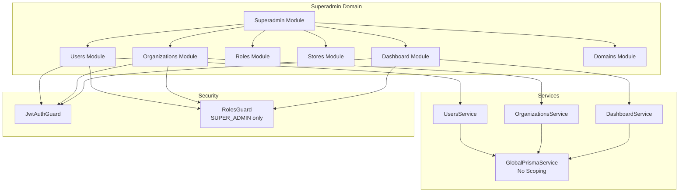

# Superadmin Domain

## What is the Superadmin Domain?

The **Superadmin Domain** provides system-wide administrative capabilities for the Vendix multi-tenant e-commerce platform. This domain handles cross-organization operations that require elevated privileges beyond individual organization or store boundaries.

## Route Prefixes

All superadmin routes are prefixed with `/admin/` to clearly distinguish system administration endpoints:

```
POST   /admin/users              # Create user (any organization)
GET    /admin/users              # List all users (global)
GET    /admin/users/dashboard    # Global user statistics
PATCH  /admin/users/:id          # Update user (any organization)
DELETE /admin/users/:id          # Delete user (any organization)

POST   /admin/organizations      # Create organization
GET    /admin/organizations      # List all organizations
GET    /admin/dashboard          # System-wide dashboard
```

## Authentication and Context

The login or access token already comes with the context of the respective domain. The Superadmin Domain uses GlobalPrismaService which provides unrestricted access to all data across the platform, with no automatic tenant restrictions applied.

### **Business Responsibilities**

- **Global User Management**: Create, modify, and deactivate users across all organizations
- **Organization Lifecycle**: Create and manage organization entities
- **System-wide Analytics**: Dashboard statistics and reporting across the entire platform
- **Domain Management**: Handle custom domain configurations and SSL certificates
- **Role & Permission Administration**: Define and assign system-wide roles and permissions
- **Store Oversight**: Monitor and manage stores across organizations

### **User Roles with Access**

- **Super Admin**: Full access to all superadmin operations
- **System Admin**: Limited administrative access (future implementation)

## 🔐 Automatic Scoping System

### **PrismaService Used**

The Superadmin Domain uses **`GlobalPrismaService`** which provides **unrestricted access** to all data across the platform.

```typescript
// Superadmin domain module configuration
@Module({
  providers: [GlobalPrismaService], // No scoping applied
  exports: [GlobalPrismaService],
})
export class SuperadminDomainModule {}
```

### **How Automatic Filtering Works**

- **No Scoping Applied**: All database queries operate without tenant restrictions
- **Full Data Access**: Can access users, organizations, stores, and global entities from any tenant
- **Context Optional**: Operations can proceed with or without user context

### **Security Implications**

- **High Risk Operations**: Requires strict authentication and authorization
- **Audit Trail**: All operations must be logged for compliance
- **Access Control**: Limited to super admin roles only

### **Examples of Scoped vs Non-Scoped Operations**

```typescript
// Superadmin Service (Global Access)
@Injectable()
export class UsersService {
  constructor(private readonly prisma: GlobalPrismaService) {}

  // Access ALL users across organizations
  async getAllUsers() {
    return this.prisma.users.findMany(); // No WHERE clauses added
  }

  // Access users from specific organization (manual filtering)
  async getUsersByOrganization(orgId: number) {
    return this.prisma.users.findMany({
      where: { organization_id: orgId }, // Manual filter required
    });
  }
}

// Organization Service (Automatic Scoping)
@Injectable()
export class OrgUsersService {
  constructor(private readonly prisma: OrganizationPrismaService) {}

  // Automatically filtered to current organization
  async getMyUsers() {
    return this.prisma.users.findMany(); // WHERE organization_id = ?
  }
}
```

## 📁 Module Structure

The Superadmin Domain consists of the following modules:

| Module               | Purpose                             | Key Operations                            |
| -------------------- | ----------------------------------- | ----------------------------------------- |
| **`dashboard/`**     | System-wide analytics and reporting | Global statistics, platform metrics       |
| **`domains/`**       | Custom domain management            | Domain registration, SSL configuration    |
| **`organizations/`** | Organization lifecycle management   | Create, update, deactivate organizations  |
| **`roles/`**         | System role administration          | Define roles, assign permissions          |
| **`stores/`**        | Cross-organization store management | Store monitoring, global store operations |
| **`users/`**         | Global user administration          | User CRUD across all organizations        |

### **Module Interaction with Scoping**

- All modules inject `GlobalPrismaService` for unrestricted data access
- Manual filtering required when operations need to be scoped to specific tenants
- Audit logging integrated into all operations for compliance

## 🌐 API Routes & Access

### **Route Patterns**

All superadmin routes are prefixed with `/admin/` to clearly distinguish system administration endpoints:

```
POST   /admin/users              # Create user (any organization)
GET    /admin/users              # List all users (global)
GET    /admin/users/dashboard    # Global user statistics
PATCH  /admin/users/:id          # Update user (any organization)
DELETE /admin/users/:id          # Delete user (any organization)

POST   /admin/organizations      # Create organization
GET    /admin/organizations      # List all organizations
GET    /admin/dashboard          # System-wide dashboard
```

### **Authentication Requirements**

- **JWT Authentication**: Required for all endpoints
- **Role-based Access**: `@Roles(UserRole.SUPER_ADMIN)` decorator
- **Guards Applied**: `JwtAuthGuard` + `RolesGuard`

```typescript
@Controller('admin/users')
@UseGuards(JwtAuthGuard, RolesGuard)
@Roles(UserRole.SUPER_ADMIN)
export class UsersController {
  // All methods require super admin authentication
}
```

### **Permission Levels**

- **Super Admin Only**: All operations require `SUPER_ADMIN` role
- **No Granular Permissions**: Operations are all-or-nothing based on role
- **Future Enhancement**: Permission-based access control planned

## 🛠️ Development Guidelines

### **When to Add New Modules to This Domain**

Add modules to the Superadmin Domain when they require:

- **Cross-organization operations** (affecting multiple tenants)
- **System administration** (platform configuration)
- **Global analytics** (platform-wide reporting)
- **Security-critical operations** (user/role management)

### **How to Ensure Proper Scoping**

1. **Always inject `GlobalPrismaService`** in new services
2. **Implement manual filtering** when operations should be tenant-scoped
3. **Add comprehensive logging** for audit trails
4. **Use super admin guards** on all controllers

```typescript
// Correct: New superadmin service
@Injectable()
export class NewSuperadminService {
  constructor(private readonly prisma: GlobalPrismaService) {}

  async globalOperation() {
    // Access all data - no automatic filtering
    return this.prisma.someModel.findMany();
  }

  async scopedOperation(orgId: number) {
    // Manual scoping when needed
    return this.prisma.someModel.findMany({
      where: { organization_id: orgId },
    });
  }
}
```

### **Testing Considerations**

- **Mock GlobalPrismaService** in unit tests
- **Test with different user contexts** (super admin vs regular users)
- **Verify audit logging** is working correctly
- **Test cross-tenant data access** scenarios

```typescript
// Example test for superadmin service
describe('SuperadminUsersService', () => {
  let service: UsersService;
  let mockPrisma: jest.Mocked<GlobalPrismaService>;

  beforeEach(() => {
    mockPrisma = createMock<GlobalPrismaService>();
    service = new UsersService(mockPrisma);
  });

  it('should access all users globally', async () => {
    mockPrisma.users.findMany.mockResolvedValue([user1, user2]);
    const result = await service.getAllUsers();
    expect(result).toHaveLength(2);
    expect(mockPrisma.users.findMany).toHaveBeenCalledWith({});
  });
});
```

## 🏗️ Architecture Diagram



---

**⚠️ Security Notice**: This domain contains the highest privilege operations in the system. All changes must undergo security review and comprehensive testing before deployment.</content>
<parameter name="filePath">apps/backend/src/domains/superadmin/README.md
