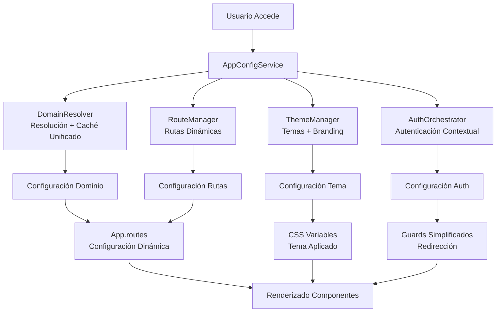

# Plan de Reestructuración del Core - Frontend Vendix

## Resumen Ejecutivo

Este documento detalla el plan de reestructuración del core de la aplicación frontend para resolver los problemas de fragmentación, redundancia y flujos rotos identificados en [`@apps/frontend/src/app/core`](apps/frontend/src/app/core).

## Problemas Identificados

### 1. Servicios Redundantes y Fragmentados
- **7 servicios con funcionalidades solapadas**
- **Caché duplicado** en múltiples servicios
- **Lógica dispersa** entre DomainDetector, AppResolver, RouteConfig

### 2. Flujos de Inicialización Rotos
- [`AppInitializerService.transformApiBranding()`](apps/frontend/src/app/core/services/app-initializer.service.ts:360) - Transformación incorrecta
- [`RouteConfigService.getComponentReference()`](apps/frontend/src/app/core/services/route-config.service.ts:193) - Retorna `null`
- **Guards redundantes** con lógica duplicada

### 3. Configuración de Temas Inconsistente
- **Mapeo incorrecto** de colores desde API
- **Hardcode** en lugar de tokens dinámicos
- **Aplicación inconsistente** entre entornos

## Arquitectura Propuesta

### Diagrama de Flujo Optimizado



### Servicios Centralizados

#### 1. AppConfigService
**Consolida:** DomainDetectorService + TenantConfigService + AppResolverService

```typescript
// apps/frontend/src/app/core/services/app-config.service.ts
@Injectable({ providedIn: 'root' })
export class AppConfigService {
  private readonly CACHE_KEY = 'vendix_app_config';
  private configSubject = new BehaviorSubject<AppConfig | null>(null);
  
  async initializeApp(): Promise<AppConfig> {
    // Flujo unificado de inicialización
    const domainConfig = await this.resolveDomain();
    const tenantConfig = await this.loadTenantConfig(domainConfig);
    const appConfig = this.buildAppConfig(domainConfig, tenantConfig);
    
    await this.applyThemeAndBranding(appConfig);
    await this.configureDynamicRoutes(appConfig);
    
    this.configSubject.next(appConfig);
    return appConfig;
  }
}
```

#### 2. RouteManager
**Consolida:** RouteConfigService + LayoutRouterService + AppResolverService (rutas)

#### 3. AuthOrchestrator  
**Consolida:** AuthContextService + lógica de guards + PostLoginLayoutGuard

### Correcciones Técnicas Críticas

#### 1. Transformación Correcta de Branding
**Problema:** [`AppInitializerService.transformApiBranding()`](apps/frontend/src/app/core/services/app-initializer.service.ts:360) no mapea correctamente.

**Solución:**
```typescript
private transformBrandingFromApi(apiBranding: any): ThemeConfig {
  return {
    primaryColor: apiBranding.primary_color,
    secondaryColor: apiBranding.secondary_color,
    accentColor: apiBranding.accent_color,
    backgroundColor: apiBranding.background_color,
    textColor: apiBranding.text_color,
    colors: {
      primary: apiBranding.primary_color,
      secondary: apiBranding.secondary_color,
      accent: apiBranding.accent_color,
      background: apiBranding.background_color,
      surface: apiBranding.background_color,
      text: {
        primary: apiBranding.text_color,
        secondary: apiBranding.text_color,
        muted: apiBranding.text_color
      }
    },
    fonts: {
      primary: 'Inter, sans-serif',
      secondary: 'Inter, sans-serif',
      headings: 'Inter, sans-serif'
    }
  };
}
```

#### 2. Configuración Dinámica de Rutas
**Problema:** [`RouteConfigService.getComponentReference()`](apps/frontend/src/app/core/services/route-config.service.ts:193) retorna `null`.

**Solución:** Implementar registro dinámico de componentes:

```typescript
// Nuevo RouteManager
private buildDynamicRoutes(appConfig: AppConfig): Routes {
  const routes: Routes = [];
  
  // Rutas públicas dinámicas
  appConfig.publicRoutes.forEach(route => {
    routes.push({
      path: route.path,
      loadComponent: () => this.getComponentLoader(route.component),
      data: { layout: route.layout }
    });
  });
  
  // Rutas privadas dinámicas
  appConfig.privateRoutes.forEach(route => {
    routes.push({
      path: route.path,
      loadComponent: () => this.getComponentLoader(route.component),
      canActivate: [AuthGuard, ...this.resolveGuards(route.guards)],
      data: { layout: route.layout }
    });
  });
  
  return routes;
}
```

#### 3. Simplificación de Guards
**Reducción de 8 guards a 3 guards unificados:**

- **DomainGuard** - Reemplaza EnvMatchGuard + DomainAppGuard
- **AuthGuard** - Guard básico de autenticación
- **RoleGuard** - Verificación de permisos por contexto

## Plan de Implementación por Fases

### Fase 1: Servicios Centralizados (Semanas 1-2)
1. **Crear AppConfigService** con caché unificado
2. **Migrar lógica** de DomainDetectorService y TenantConfigService
3. **Implementar RouteManager** con registro dinámico de componentes
4. **Configurar ThemeManager** con transformación correcta

### Fase 2: Rutas y Guards (Semanas 3-4)
1. **Reestructurar [`app.routes.ts`](apps/frontend/src/app/app.routes.ts)** para configuración dinámica
2. **Implementar guards simplificados**
3. **Migrar lógica** de AuthContextService a AuthOrchestrator
4. **Configurar redirección** post-login unificada

### Fase 3: Temas y Branding (Semana 5)
1. **Implementar sistema de temas** 100% basado en tokens del backend
2. **Eliminar hardcode** de colores y estilos
3. **Configurar CSS variables** dinámicas
4. **Validar aplicación** de branding en todos los entornos

### Fase 4: Limpieza y Validación (Semana 6)
1. **Eliminar servicios obsoletos**
2. **Validar flujo completo** desde detección de dominio hasta renderizado
3. **Documentar nueva arquitectura**
4. **Realizar pruebas** multi-tenant

## Servicios a Eliminar

### Servicios Redundantes Identificados:
- [`AuthContextService`](apps/frontend/src/app/core/services/auth-context.service.ts)
- [`LayoutRouterService`](apps/frontend/src/app/core/services/layout-router.service.ts) 
- [`RouteConfigService`](apps/frontend/src/app/core/services/route-config.service.ts)
- [`AppResolverService`](apps/frontend/src/app/core/services/app-resolver.service.ts) (parcial)

### Guards a Consolidar:
- [`EnvMatchGuard`](apps/frontend/src/app/core/guards/env-match.guard.ts)
- [`DomainAppGuard`](apps/frontend/src/app/core/guards/domain-app.guard.ts)
- [`PostLoginLayoutGuard`](apps/frontend/src/app/core/guards/post-login-layout.guard.ts)

## Beneficios Esperados

### 1. Mejora de Performance
- **Caché centralizado** elimina llamadas duplicadas a API
- **Inicialización más rápida** con flujo unificado
- **Menos memoria** con servicios consolidados

### 2. Mejora de Mantenibilidad
- **Código cohesivo** - lógica relacionada en un lugar
- **Menos archivos** - reducción de complejidad
- **Mejor trazabilidad** - flujos más fáciles de seguir

### 3. Escalabilidad
- **Fácil agregar** nuevos tipos de tenant
- **Configuración dinámica** sin modificar código
- **Arquitectura modular** para crecimiento futuro

### 4. Experiencia de Desarrollo
- **API consistente** entre servicios
- **Documentación clara** de flujos
- **Debugging más fácil** con menos puntos de falla

## Validación y Criterios de Éxito

### Criterios Técnicos
- [ ] **100% de temas** vienen del backend, cero hardcode
- [ ] **Configuración de rutas** dinámica funciona en todos los entornos
- [ ] **Caché unificado** previene llamadas duplicadas a API
- [ ] **Guards simplificados** manejan correctamente todos los flujos
- [ ] **Performance mejorada** en inicialización de aplicación

### Criterios Funcionales
- [ ] **Autenticación contextual** funciona correctamente por dominio
- [ ] **Redirección post-login** adecuada al contexto
- [ ] **Branding aplicado** consistentemente en todos los componentes
- [ ] **Rutas accesibles** según permisos y contexto

## Próximos Pasos

1. **Revisión y aprobación** de este plan
2. **Asignación de recursos** para implementación
3. **Creación de tickets** detallados por fase
4. **Coordinación con backend** para ajustes en API de dominio

---

**Documento creado por:** Kilo Code - Arquitecto  
**Fecha:** 2025-10-14  
**Versión:** 1.0