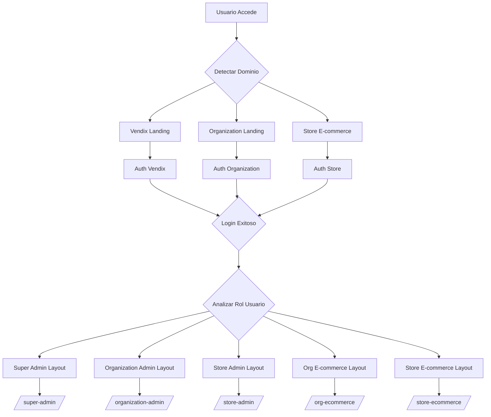
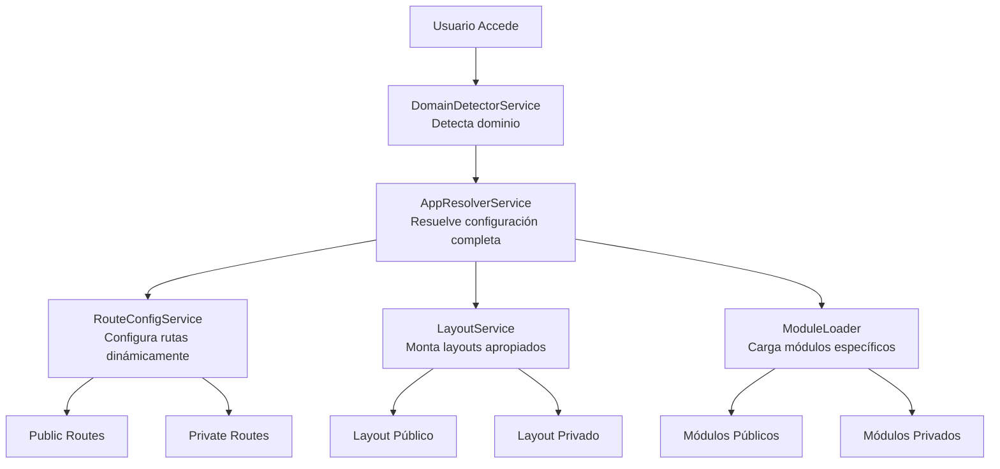

# Plan de Reestructuración - Frontend Multi-Tenant Vendix

## Análisis de la Estructura Actual

### Problemas Identificados

1. **Organización Confusa**: Los módulos están mezclados sin separación clara entre público/privado
2. **Flujo Complejo**: El sistema de rutas y guards es difícil de seguir
3. **Duplicación**: Múltiples layouts con responsabilidades solapadas
4. **Falta de Contextualización**: El auth no está completamente contextualizado por dominio
5. **Escalabilidad Limitada**: Estructura actual dificulta agregar nuevos tipos de tenant

## Nueva Estructura Optimizada

### Directorios Principales

```
apps/frontend/src/app/
├── public/                          # Todo el contenido público/pre-login
│   ├── landing/                     # Landing principal de Vendix
│   │   ├── components/              # Componentes específicos del landing
│   │   └── pages/                   # Páginas del landing
│   ├── auth/                        # Autenticación contextual
│   │   ├── components/              # Componentes reutilizables de auth
│   │   ├── contexts/                # Contextos por tipo de dominio
│   │   │   ├── vendix/              # Auth para dominio Vendix
│   │   │   ├── organization/        # Auth para organizaciones
│   │   │   └── store/               # Auth para tiendas
│   │   └── services/                # Servicios de auth contextual
│   ├── dynamic-landing/             # Landing dinámico para orgs/tiendas
│   │   ├── components/              # Componentes dinámicos
│   │   └── pages/                   # Páginas de landing dinámico
│   └── ecommerce/                   # E-commerce público
│       ├── components/              # Componentes de e-commerce
│       ├── pages/                   # Páginas de tienda
│       └── services/                # Servicios de e-commerce
├── private/                         # Todo el contenido post-login
│   ├── layouts/                     # Layouts específicos por rol/contexto
│   │   ├── super-admin/             # Layout super administrador
│   │   ├── organization-admin/      # Layout administrador organizacional
│   │   ├── store-admin/             # Layout administrador de tienda
│   │   ├── org-ecommerce/           # E-commerce organizacional (post-login)
│   │   └── store-ecommerce/         # E-commerce de tienda (post-login)
│   ├── super-admin/                 # Módulo super administrador
│   ├── organization-admin/          # Módulo administrador organizacional
│   ├── store-admin/                 # Módulo administrador de tienda
│   ├── org-ecommerce/               # E-commerce organizacional post-login
│   └── store-ecommerce/             # E-commerce de tienda post-login
├── core/                            # Núcleo de la aplicación
│   ├── services/                    # Servicios base
│   ├── guards/                      # Guards de seguridad
│   ├── models/                      # Modelos de datos
│   ├── store/                       # Estado global
│   └── utils/                       # Utilidades
└── shared/                          # Componentes compartidos
    ├── components/                  # Componentes UI reutilizables
    ├── directives/                  # Directivas compartidas
    └── pipes/                       # Pipes compartidos
```

## Flujo de Autenticación Multi-Tenant



## Implementación de Auth Contextual

### Servicio de Auth Contextual

```typescript
// apps/frontend/src/app/public/auth/services/contextual-auth.service.ts
@Injectable()
export class ContextualAuthService {
  constructor(
    private domainDetector: DomainDetectorService,
    private http: HttpClient
  ) {}

  async getAuthContext(): Promise<AuthContext> {
    const domainConfig = await this.domainDetector.detectDomain();
    
    return {
      type: domainConfig.environment,
      branding: domainConfig.customConfig?.branding,
      organization: domainConfig.organizationSlug,
      store: domainConfig.storeSlug,
      allowedRoles: this.getAllowedRoles(domainConfig.environment),
      redirectUrl: this.getPostLoginRedirect(domainConfig.environment)
    };
  }

  private getAllowedRoles(environment: AppEnvironment): string[] {
    switch(environment) {
      case AppEnvironment.VENDIX_LANDING:
        return ['super_admin', 'admin', 'owner'];
      case AppEnvironment.ORG_LANDING:
        return ['owner', 'admin', 'manager', 'customer'];
      case AppEnvironment.STORE_ECOMMERCE:
        return ['owner', 'admin', 'manager', 'employee', 'customer'];
      default:
        return [];
    }
  }
}
```

### Componentes de Auth por Contexto

- **Vendix Auth**: Registro de nuevas organizaciones, login super admin
- **Organization Auth**: Login para miembros de organización, registro limitado
- **Store Auth**: Login para empleados/clientes de tienda específica

## Plan de Migración

### Fase 1: Estructura de Directorios
1. Crear nueva estructura de directorios
2. Mover componentes existentes a nuevas ubicaciones
3. Actualizar imports y rutas

### Fase 2: Auth Contextual
1. Implementar servicio de auth contextual
2. Crear componentes de auth específicos por contexto
3. Migrar lógica de guards existentes

### Fase 3: Layouts Optimizados
1. Refactorizar layouts existentes
2. Implementar nuevos layouts específicos
3. Actualizar sistema de redirección post-login

### Fase 4: Testing y Validación
1. Probar todos los flujos de autenticación
2. Validar redirecciones post-login
3. Asegurar compatibilidad multi-tenant

## Beneficios Esperados

1. **Separación Clara**: Público vs privado completamente separado
2. **Contextualización Total**: Auth y contenido adaptado al dominio
3. **Escalabilidad**: Fácil agregar nuevos tipos de tenant
4. **Mantenibilidad**: Código mejor organizado y más fácil de entender
5. **Experiencia de Usuario**: Flujos más intuitivos y contextualizados

## Flujo de Resolución de Aplicación Multi-Tenant

### Problemas Actuales de Resolución

El flujo actual de resolución que configura y decide qué vistas y componentes se montan está **fragmentado** en varios lugares:

1. **Fragmentación**: La lógica de resolución está dispersa en 5+ archivos
2. **Configuración No Utilizada**: [`getRouteConfigForEnvironment()`](apps/frontend/src/app/core/services/app-initializer.service.ts:167) define módulos pero NO se aplica
3. **Hardcodeo**: Rutas como `/shop`, `/admin` están fijas en lugar de ser dinámicas
4. **Falta de Centralización**: No hay un punto único de verdad para la resolución de aplicación

### Puntos de Resolución Actuales:

- **[`DomainDetectorService`](apps/frontend/src/app/core/services/domain-detector.service.ts:31)** - Detecta dominio y construye configuración
- **[`AppInitializerService`](apps/frontend/src/app/core/services/app-initializer.service.ts:31)** - Inicializa servicios pero NO aplica configuración de rutas
- **[`app.routes.ts`](apps/frontend/src/app/app.routes.ts)** - Usa guards para decidir rutas raíz
- **[`EnvMatchGuard`](apps/frontend/src/app/core/guards/env-match.guard.ts:7)** - Compara entorno actual con rutas permitidas
- **[`DomainAppGuard`](apps/frontend/src/app/core/guards/domain-app.guard.ts:19)** - Maneja redirección basada en dominio

### Nueva Arquitectura de Resolución Centralizada

#### Servicio Centralizado: `AppResolverService`

```typescript
// apps/frontend/src/app/core/services/app-resolver.service.ts
@Injectable()
export class AppResolverService {
  constructor(private domainDetector: DomainDetectorService) {}

  async resolveAppConfiguration(): Promise<AppConfig> {
    const domainConfig = await this.domainDetector.detectDomain();
    
    return {
      environment: domainConfig.environment,
      publicRoutes: this.resolvePublicRoutes(domainConfig),
      privateRoutes: this.resolvePrivateRoutes(domainConfig),
      layouts: this.resolveLayouts(domainConfig),
      modules: this.resolveModules(domainConfig),
      features: this.resolveFeatures(domainConfig)
    };
  }

  private resolvePublicRoutes(domainConfig: DomainConfig): RouteConfig[] {
    switch(domainConfig.environment) {
      case AppEnvironment.VENDIX_LANDING:
        return [
          { path: '/', component: 'VendixLandingComponent' },
          { path: '/auth/login', component: 'VendixAuthComponent' },
          { path: '/auth/register', component: 'VendixRegisterComponent' }
        ];
      case AppEnvironment.ORG_LANDING:
        return [
          { path: '/', component: 'OrgLandingComponent' },
          { path: '/auth/login', component: 'OrgAuthComponent' },
          { path: '/shop', component: 'OrgEcommerceComponent' }
        ];
      // ... otros entornos
    }
  }
}
```

#### Flujo de Resolución Optimizado:



#### Beneficios de la Centralización:

- ✅ **Un solo punto de verdad** para la resolución de aplicación
- ✅ **Configuración dinámica** basada en dominio
- ✅ **Separación clara** entre público/privado
- ✅ **Escalabilidad** para nuevos tipos de tenant
- ✅ **Mantenibilidad** con lógica cohesiva

## Archivos Críticos a Modificar

1. [`app.routes.ts`](apps/frontend/src/app/app.routes.ts) - Reestructurar completamente
2. [`app-initializer.service.ts`](apps/frontend/src/app/core/services/app-initializer.service.ts) - Mejorar inicialización
3. [`domain-detector.service.ts`](apps/frontend/src/app/core/services/domain-detector.service.ts) - Extender para auth contextual
4. [`layout-router.service.ts`](apps/frontend/src/app/core/services/layout-router.service.ts) - Optimizar redirección
5. **NUEVO**: `app-resolver.service.ts` - Servicio centralizado de resolución
6. **NUEVO**: `route-config.service.ts` - Configuración dinámica de rutas

## Próximos Pasos

1. **Aprobación**: Revisar y aprobar este plan
2. **Implementación**: Ejecutar migración por fases
3. **Testing**: Validar exhaustivamente todos los flujos
4. **Documentación**: Actualizar documentación para desarrolladores

**¿Está de acuerdo con este plan de reestructuración? ¿Hay algún aspecto específico que le gustaría modificar o profundizar?**