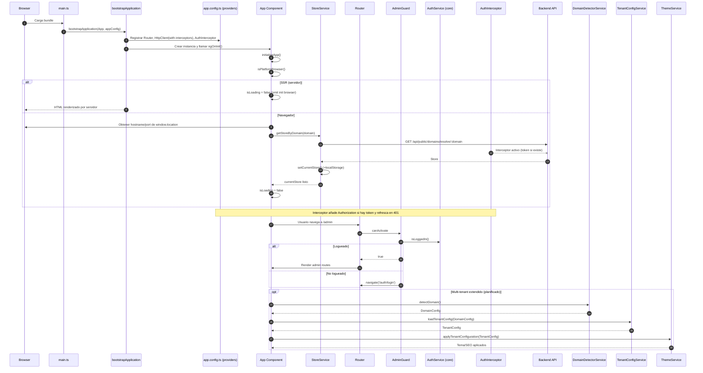

# Flujo de Inicialización (Entry → App usable)

Este documento resume el flujo real del arranque en el frontend y los servicios que intervienen, además del flujo extendido multi-tenant planificado.

Archivos implicados:
- `src/main.ts` — arranque con `bootstrapApplication(App, appConfig)`
- `src/app/app.config.ts` — providers (Router, HttpClient + `AuthInterceptor`, Hydration)
- `src/app/app.ts` — componente raíz, `ngOnInit()` llama a `initializeApp()`
- Cross-cutting: `core/interceptors/auth.interceptor.ts`, `core/guards/admin.guard.ts`, `core/services/auth.service.ts`
- Multi-tenant (plan): `core/services/app-initializer.service.ts`, `domain-detector.service.ts`, `tenant-config.service.ts`, `theme.service.ts`

## Diagrama de Secuencia (flujo actual + extendido)



## Diagrama de Flujo (decisiones clave)

```mermaid
flowchart TD
  A[Entry: main.ts → bootstrapApplication] --> B{¿SSR?}
  B -- Sí --> C[Omitir init de navegador\n isLoading=false]
  B -- No --> D[App.initializeApp()]
  D --> E[window.location → dominio]
  E --> F[StoreService.getStoreByDomain]
  F --> G[API: /api/public/domains/resolve/:domain]
  G --> H[setCurrentStore + localStorage]
  H --> I[isLoading=false → UI lista]
  I --> J{¿Ruta /admin?}
  J -- Sí --> K[AdminGuard → AuthService.isLoggedIn]
  K -- No --> L[navigate /auth/login]
  K -- Sí --> M[Render admin/dashboard]
  I --> N[Otras rutas usables]

  subgraph Cross-cutting
    X[AuthInterceptor] --> |Añade Authorization si hay token| anyHTTP[HTTP]
    Y[401] --> |refreshToken| Z[AuthService]
    Z --> |nuevo token| anyHTTP
  end

  subgraph Multi-Tenant (opcional)
    P1[DomainDetectorService.detectDomain]
    P2[TenantConfigService.loadTenantConfig]
    P3[ThemeService.applyTenantConfiguration]
    D --> P1 --> P2 --> P3 --> I
  end
```

## Servicios que intervienen

- StoreService (`core/services/store.service.ts`) — Resuelve tienda por dominio y persiste estado.
- AuthInterceptor (`core/interceptors/auth.interceptor.ts`) — Adjunta Bearer token y refresca en 401.
- AuthService (core) (`core/services/auth.service.ts`) — Maneja login/logout/refresh y estado de usuario.
- AdminGuard (`core/guards/admin.guard.ts`) — Protege `/admin` verificando sesión.
- DomainDetectorService (`core/services/domain-detector.service.ts`) — Detecta entorno por dominio (flujo extendido planificado).
- TenantConfigService (`core/services/tenant-config.service.ts`) — Carga/cacha configuración de tenant.
- ThemeService (`core/services/theme.service.ts`) — Aplica tema/branding/SEO según tenant.
- AppInitializerService (`core/services/app-initializer.service.ts`) — Orquestador del init multi-entorno (a integrar si se desea el flujo extendido).

## Observaciones
- El flujo actual deja la app usable cuando `StoreService` resuelve la tienda y `isLoading=false`. La navegación y HTTP ya están disponibles con el `AuthInterceptor` activo.
- Para tener branding/tema/SEO por tenant desde el arranque, integrar `AppInitializerService` invocando `DomainDetectorService → TenantConfigService → ThemeService` antes de marcar `isLoading=false`.
