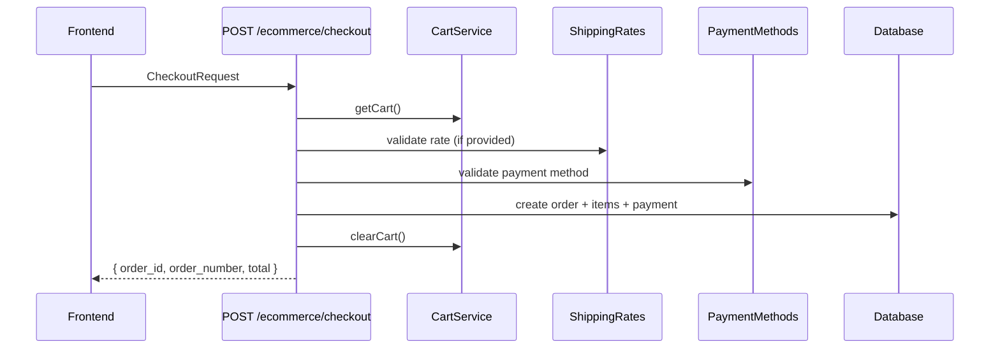

# Vendix Ecommerce Checkout Flow

> **Complete Checkout Flow** - From cart to order creation, including shipping and payment.

## 🎯 Overview

The ecommerce checkout handles online sales through `STORE_ECOMMERCE` app. It processes cart items, validates shipping, calculates totals, and creates orders.

---

## 📊 Data Flow



---

## 🔧 Backend Components

### CheckoutDto

```typescript
// apps/backend/src/domains/ecommerce/checkout/dto/checkout.dto.ts
export class CheckoutDto {
    @IsOptional() @IsInt() shipping_method_id?: number;
    @IsOptional() @IsInt() shipping_rate_id?: number;
    @IsOptional() @IsInt() shipping_address_id?: number;
    @IsOptional() @IsObject() shipping_address?: ShippingAddressDto;
    @IsInt() payment_method_id: number;
    @IsOptional() @IsString() notes?: string;
}
```

### CheckoutService Key Steps

1. **Get Cart** - Retrieve cart with items
2. **Validate Payment Method** - Check enabled and belongs to store
3. **Validate Stock** - Ensure all items have sufficient stock
4. **Process Address** - Create new or use existing
5. **Validate Shipping** - Check rate/method if provided
6. **Calculate Totals** - subtotal + shipping_cost = grand_total
7. **Create Order** - With items, addresses, shipping info
8. **Create Payment** - Pending payment record
9. **Update Stock** - Decrement quantities
10. **Clear Cart** - Remove cart items

---

## 🌐 Frontend Components

### Key Files

| File | Purpose |
|------|---------|
| `checkout.component.ts` | Main checkout page component |
| `checkout.service.ts` | API calls for checkout |
| `cart.service.ts` | Cart management + shipping estimates |

### CheckoutRequest Interface

```typescript
export interface CheckoutRequest {
    shipping_address_id?: number;
    shipping_address?: AddressDto;
    shipping_method_id?: number;
    shipping_rate_id?: number;
    payment_method_id: number;
    notes?: string;
}
```

### Checkout Steps UI

1. **Address Selection** - Pick existing or enter new
2. **Shipping Method** - Load options via `getShippingEstimates()`
3. **Payment Method** - Select from store's enabled methods
4. **Confirmation** - Review and place order

---

## 📦 Database Models

### orders

```prisma
model orders {
    id                    Int
    store_id              Int
    customer_id           Int?
    order_number          String
    channel               order_channel_enum  // 'pos' | 'ecommerce' | 'agent' | 'whatsapp' | 'marketplace'
    shipping_address_id   Int?
    shipping_method_id    Int?
    shipping_cost         Decimal
    subtotal_amount       Decimal
    grand_total           Decimal
    state                 order_state_enum
    // ... relationships
}
```

> **Note:** The `channel` field is auto-assigned:
> - `'ecommerce'` - Orders from CheckoutService (online storefront)
> - `'pos'` - Orders from PaymentsService.processPosPayment (point of sale)

### Related Models

- `cart_items` - Items being purchased
- `shipping_methods` - Delivery options
- `shipping_rates` - Zone-specific pricing
- `store_payment_methods` - Enabled payments

---

## ⚠️ Error Handling

| Error | Cause | Message |
|-------|-------|---------|
| 400 | Empty cart | "Cart is empty" |
| 400 | Invalid payment | "Invalid payment method" |
| 400 | Stock issue | "Insufficient stock for {product}" |
| 400 | Bad shipping | "Método de envío inválido" |
| 400 | Wrong store | "Método de envío no disponible para esta tienda" |

---

## 🔗 Related Skills

- `vendix-backend-api` - API patterns
- `vendix-error-handling` - Error handling
- `vendix-frontend-state` - State management
- `vendix-multi-tenant-context` - Store context
